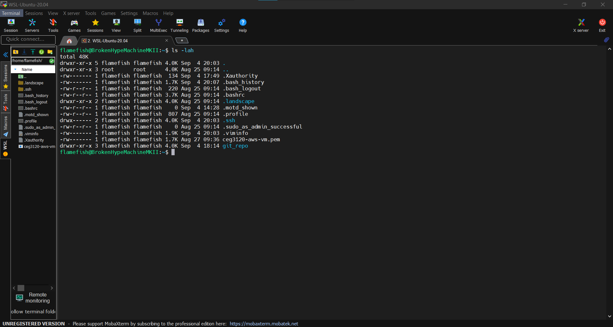
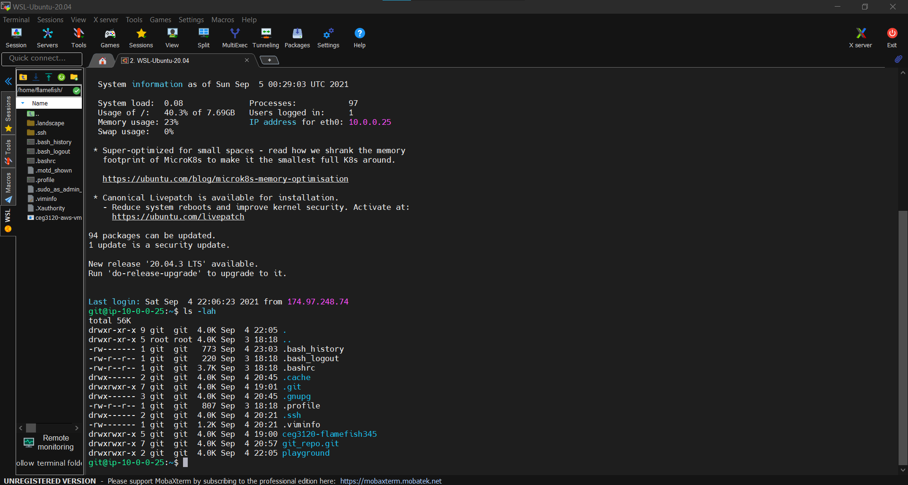

# My Project 1

# Create user 'git'

- I used ```sudo adduser git``` to create my user named 'git'.

- Switch over to 'git' using ```sudo su git```

# Give 'git' access to ssh capabilities

- Typing ```mkdir .ssh```, I have created a folder for my ssh keys for 'git' to use.

- Going into the .ssh directory of 'git', ```cd .ssh```, I type ```vim authorized_keys``` to open the vim text editor to create the file 'authorized_keys`.

- Opening another terminal, I type ```cat ceg3120-aws-vm.pem``` and copy the contents of my public key that I created in AWS.

- Back to the previous terminal with the vim text editor for 'authorized_keys' open, I press ```ESC key, i``` to insert the copied contents of my public key.

- I press 'ESC' again, then ```:wq authorized_keys``` to save and exit the file.

- Then I type ```chmod 600 authorized_keys``` to give this file read/write privelages 

- Now I type ```cd ..``` to head back to the home directory.

# Making a connection to git using the 'ssh' command

- To test that I had done everything correctly, I first ```exit``` my AWS instance.

- Now, I type in ``` ssh -i ceg3120-aws-vm.pem git@<AWS_IP Address> ``` to make a connection to the user 'git' on my AWS instance.

- This will tell me that 'git' now has 'ssh' capabilities.

# Create a repository in git's directory

- Now to make an empty repository in git's home directory.

- I type ``` git init --bare <repo_name>.git ``` to create 'git_repo' with the .git folder.

- now to head back to my second terminal

# Adding a host by editing ssh config

- In the second terminal, on my local machine, I type ``` cd .ssh ``` to switch over to the .ssh directory.

- Now I type ``` vim config ``` to edit the ssh config file so I can add my AWS instance as a host network.

- First I press ESC key then ```i``` to insert content to the config file.

- I type (following the proper formatting) ```Host <server_name>``` to give my server a name.

- Then I press enter, then 'Tab' key, and type ```Hostname <AWS_IP Address>``` to give the IP address of my AWS instance.

- Press enter, then 'Tab' key again, and type ```User ubuntu``` to give the name of the admin of the server.

- Press enter, then 'Tab' key one more time, and type ```IdentityFile \path\to\public\key``` to give the file the location of where the public key to access the AWS instance is.

- Finally, I move the insert cursor to the start of 'Host', press enter, then back to the blank line to type a mark up titled ```# 2021 fall keys```.

- Now, to press 'ESC' key, then ```:wq``` to save and quit the editor for the ssh config file.

- I type ```cat config``` to show me the contents of the config file to make sure I did the changes properly.

- Now to type ```cd ..``` to go back to my home directory.

# Clone the git repository in the AWS instance to local machine

- Now that we have the AWS instance ip address in our ssh config file, we can now clone the repository made in user git's directory to our local machine.

- I type ```git clone git@AWS_IP:repo_name.git``` to clone the repository to our local machine.

- I will get the warning that I cloned an empty git repository.

- Finally, I type ```ls -lah``` to show all the contents of my home directory and showing that I have successfully cloned the git repository.






