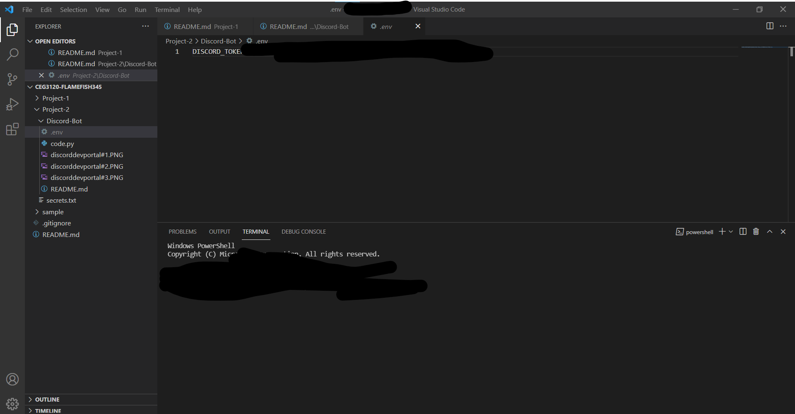
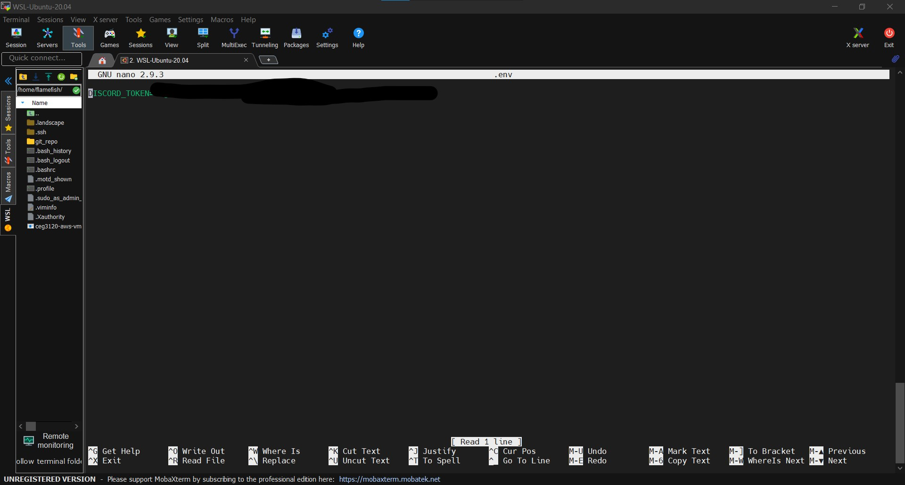
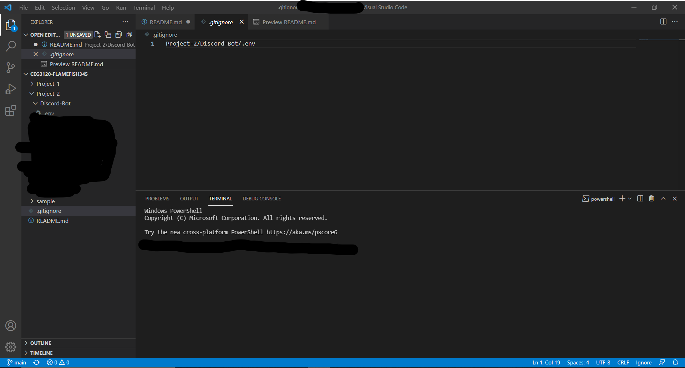

# Project 2 Documentation

# How to get your API Key

- This is here for those that have been making the error of having their own API key for their bot program get shown on GitHub.

- You might have received a message from Discord which is like this:

- 'Hey User####,

    Safety Jim here! It appears that the token for your bot, MstieQuoteBot has been posted to the internet. Luckily, our token-scanning gremlins noticed, and have reset your bot's token - hopefully before anyone could have maliciously used it!

    Your token was found here: 

    Be more careful in the future, and make sure to not accidentally upload your token publicly!

    Obtain a New Bot Token: '

- First go to the Discord Developer Portal and click on your application.

- This will take you to 'General Information'

- Next click on 'OAuth2', this will take you to your bot's API key page

- At this point, Discord should have changed your API key when it became exposed on GitHub but if you need to, click on the 'Regenerate' button to create a new key and then click 'Copy' to copy the key to paste into your .env file in Visual Studio Code or WSL.

# Hiding your API key on GITHub

- Before we commit your .env file to the repository, first we must add the file to a special folder that will obscure certain files from being seen through places like GitHub. In turn, this will prevent your API key from being exposed resulting in the error shown earlier.

- If you have not already, create a new folder using VSC called ".gitignore".

- Then, type in your .gitignore folder the file path of your .env file.

