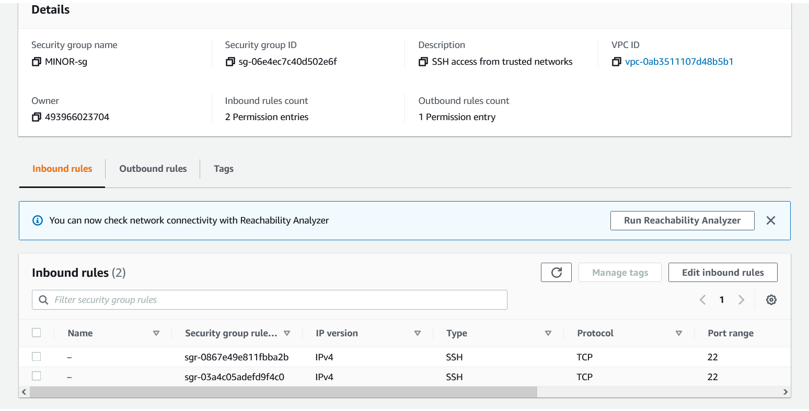

# My Project 3 Documentation

# My VPC
- This is my virtual network where I can launch AWS resources to connected machines that communicate within my network. It has a CIDR IP address of 10.0.0.0/24 which gives me access to 256 useable private IP addresses that can be managed on my network.

# My Subnet
- This gives my the VPC the range of possible private IP addresses on my network. A /28 block will give me access to 14 useable private IP addresses.

