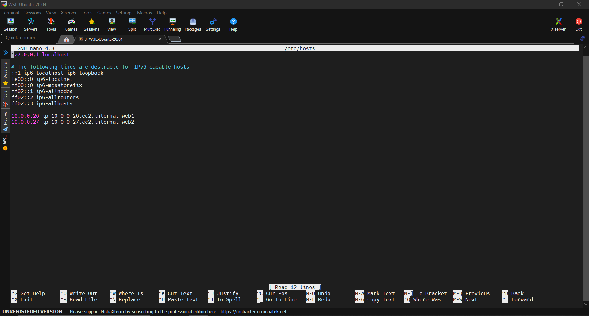

# My Project 5 Documentation

# How to configure hostnames

- First I will ssh into my proxy server "ssh -i aws-ceg-3120 ubuntu@[server ip address]"

- Next in my home directory, I type "sudo nano /etc/hosts"

- I am then taken into a text editor where I can add the hosts of my two web servers using their private IP addresses

- I then type in the follow hosts in this format " IPAddress DomainName DomainAliases "

- Then I press Ctrl + X to exit and press Y to save my /etc/hosts document

