# My Project 5 Documentation

# How to configure hostnames

- First I will ssh into my proxy server "ssh -i aws-ceg-3120 ubuntu@[server ip address]"

- Next in my home directory, I type "sudo nano /etc/hosts"

- I am then taken into a text editor where I can add the hosts of my two web servers using their private IP addresses

- I then type in the follow hosts in this format " IPAddress DomainName DomainAliases "

- Then I press Ctrl + X to exit and press Y to save my /etc/hosts document

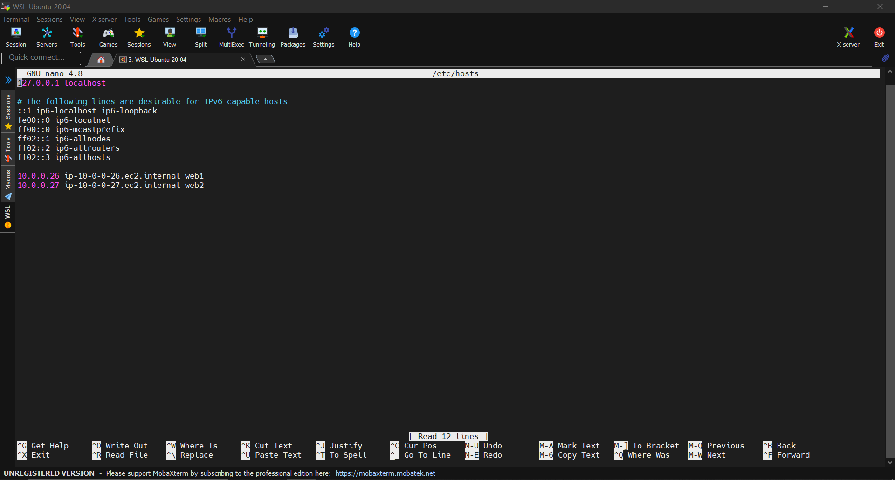

# How to SSH to your webservers

- First I create a new file to hold my private key using the "touch" command.

- Next, and thanks to adding my webservers to my /etc/hosts file, I can use the ssh command to connect to either webserver through my proxy server.

- I type "ssh -i aws-ceg3120 ubuntu@[hostname of webserver]

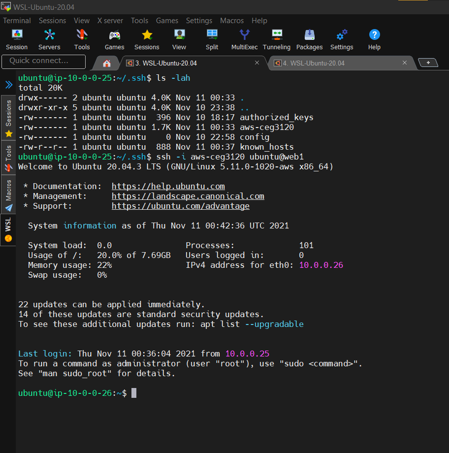

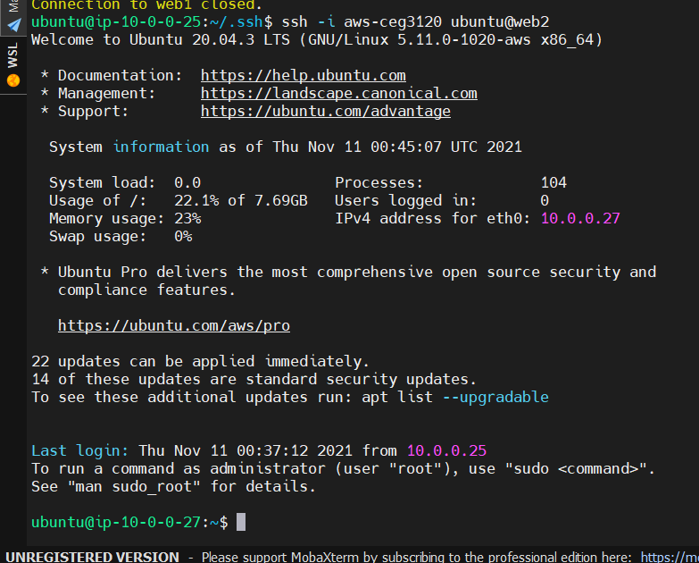

# How to install and configure HAProxy

- In the CloudFormation template file the command to install haproxy was "apt-get install -y haproxy && \".

- I believe, typing in "sudo install haproxy" in Linux should also install HAProxy as well.

- Now to make sure that the HAProxy service is running, I type out a 'systemctl' command to get the status of the service.

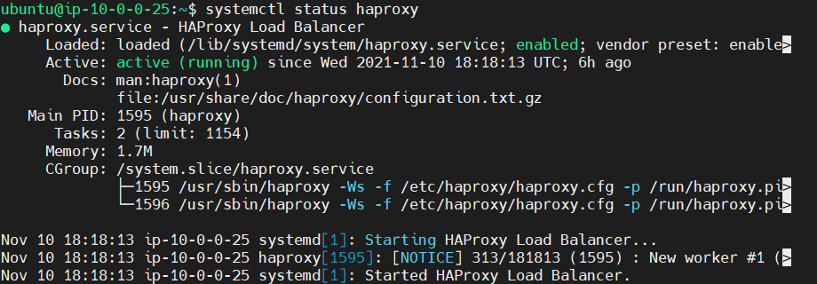

- Now, I 'cd' over to "/etc/haproxy/ to get to my config file.

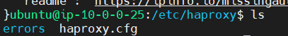

- Since haproxy files are controlled by root, I use the 'sudo' command to edit my config file, "sudo vim haproxy.cfg"

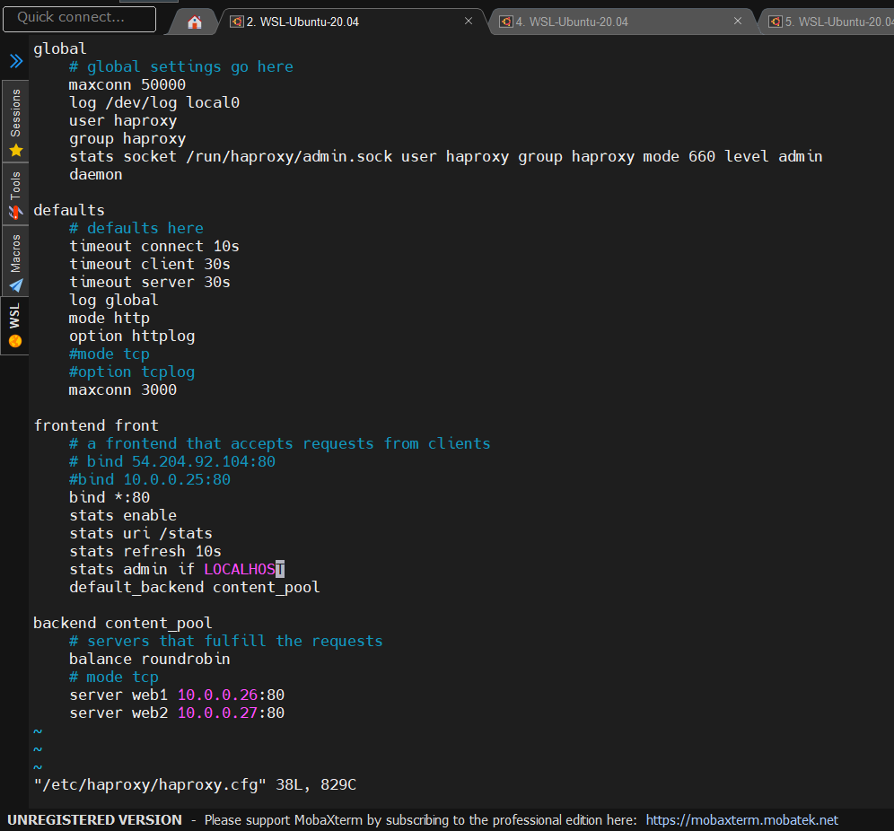

- From top to bottom in our config file, we have four important sections of every HAProxy config file.

- First we have the 'global' section, which houses our security and performance settings for our proxy. 'maxconn' is how many connections the proxy server will accept at a time. 'log' is to setup where alerts/warnings that occur on our proxy server getting 'logged' at a certain section of the server, in this case the directory /dev/log and in the file local10. 'user' and 'group' identifies where and when the proxy should drop certain privileges. 'stats socket' is our settings for the Runtime API for our proxy server.

- Then we have the 'defaults' section 

- In the 'frontend' section

- Finally, in the 'backend' section 

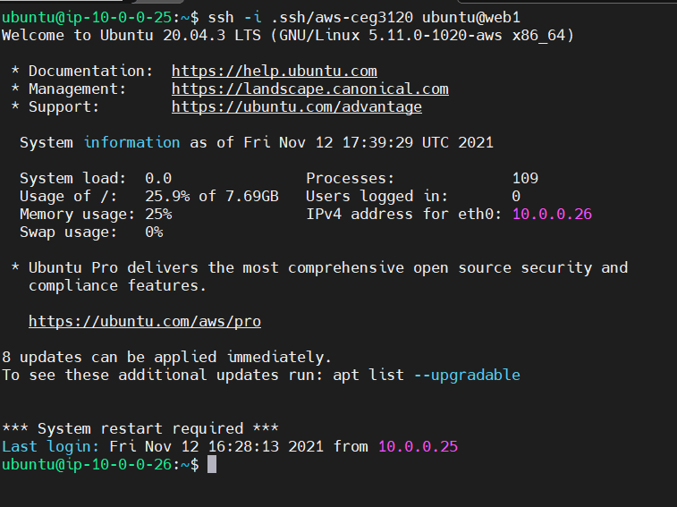

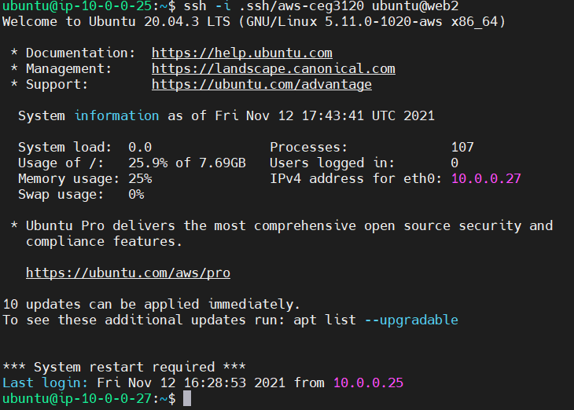

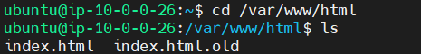

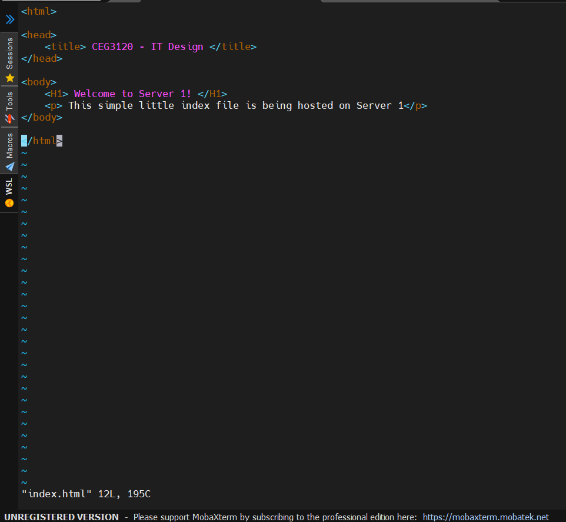

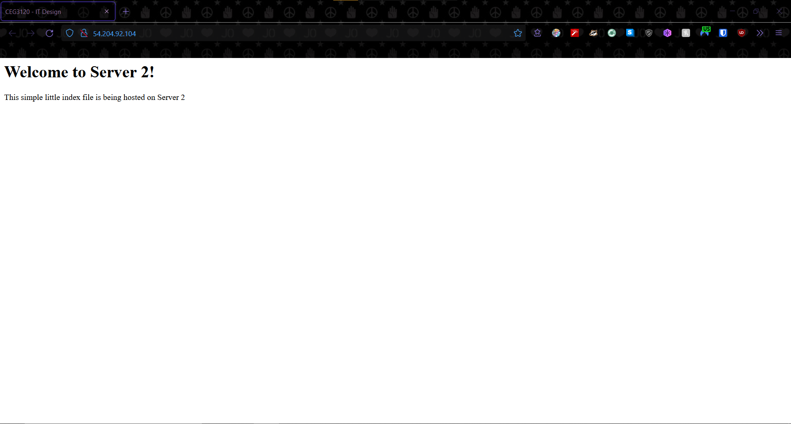