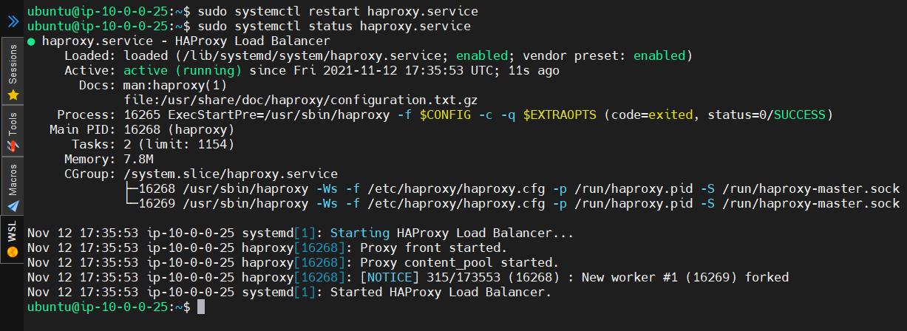

# My Project 5 Documentation

# How to configure hostnames

- First I will ssh into my proxy server "ssh -i aws-ceg-3120 ubuntu@[server ip address]"

- Next in my home directory, I type "sudo nano /etc/hosts"

- I am then taken into a text editor where I can add the hosts of my two web servers using their private IP addresses

- I then type in the follow hosts in this format " IPAddress DomainName DomainAliases "

- Then I press Ctrl + X to exit and press Y to save my /etc/hosts document

# How to SSH to your webservers

- First I create a new file to hold my private key using the "touch" command.

- Next, and thanks to adding my webservers to my /etc/hosts file, I can use the ssh command to connect to either webserver through my proxy server.

- I type "ssh -i aws-ceg3120 ubuntu@[hostname of webserver]

# How to install and configure HAProxy

- In the CloudFormation template file the command to install haproxy was "apt-get install -y haproxy && \".

- I believe, typing in "sudo install haproxy" in Linux should also install HAProxy as well.

- Now to make sure that the HAProxy service is running, I type out a 'systemctl' command to get the status of the service.

- Now, I 'cd' over to "/etc/haproxy/ to get to my config file.

- Since haproxy files are controlled by root, I use the 'sudo' command to edit my config file, "sudo vim haproxy.cfg"

- From top to bottom in our config file, we have four important sections of every HAProxy config file.

- First we have the 'global' section, which houses our security and performance settings for our proxy. 'maxconn' is how many connections the proxy server will accept at a time. 'log' is to setup where alerts/warnings that occur on our proxy server getting 'logged' at a certain section of the server, in this case the directory /dev/log and in the file local10. 'user' and 'group' identifies where and when the proxy should drop certain privileges. 'stats socket' is our settings for the Runtime API for our proxy server.

- Then we have the 'defaults' section 

- In the 'frontend' section

- Finally, in the 'backend' section 

- After all of my configurations are set, I press 'ESC' to get out of insert mode, type ':wq' to save and quit vim.

- Next, to make sure I have a valid config file, I type 'haproxy -c -f haproxy.cfg' and the output should either be an error or give me the message "Configuration file is valid".

- Now that my config is valid, I will need to restart haproxy to make sure the new settings are integrated. I type 'sudo systemctl restart haproxy.service'.

- After that I type 'sudo systemctl status haproxy.service' to make sure haproxy is running.

- Now our proxy should be properly configured, we move on to our 2 webe servers.

# How to configure the index.html files in your web servers

- First, I want to ssh from my proxy to either one of the web servers using the command from eariler, 'ssh -i .ssh/aws-ceg3120 ubuntu@web1'.

- Now I need to locate my index file called 'index.html' which I checked earlier by accessing my proxy via browser and the Apache 2 documentation tells me that 'index.html' is located in '/var/www/http'. So I 'cd' over to that location.

- The 'index.html.old' is the original file that I changed so I could make a new 'index' file. These files are also controlled by root so I will use sudo when I type 'sudo vim index.html' to edit the file.

- We copy the html code provided at the project 5 github: https://github.com/pattonsgirl/Fall2021-CEG3120/tree/main/Projects/Project5.

- Then we paste the code into the 'index.html' file and then type ':wq' to save and quit.

- We repeat the process in web server 2 and edit the file to include the code from the server 2 html code from the project 5 github.

- Now we test out our new proxy and web servers by typing the public IP address into a browser the following pages should display.

- Thanks to our 'default' rules we setup in our haproxy.cfg, everytime we reload the page, we should swap between server 1 and server 2.

Link to the proxy server: https://54.204.92.104/